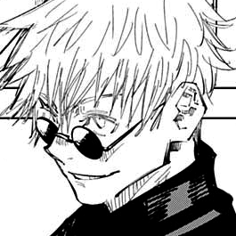

<!DOCTYPE html>
<html lang="en">

<head>
    <meta charset="UTF-8">
    <meta http-equiv="X-UA-Compatible" content="IE=edge">
    <meta name="viewport" content="width=device-width, initial-scale=1.0">
    <title>Irina Altamirano</title>
    </head>
   

<body>

 <h1 style="text-align:center">Irina Altamirano</h1>
 
 Hola ʕ•́ᴥ•̀ʔっ

  

 <ul>
      <li> <h1>Sobre mí:</h1> </li>
      
Tengo 19 años y soy de Paraná, ER. Terminé el secundario en 2020 y me anoté a esta carerra ya que siempre me llamó la antención crear cosas, y sobre todo la creación de un videojuego y su desarrollo.
          En mi tiempo libre suelo dibujar, leer o jugar videojuegos (ɔ◔‿◔)ɔ 

      <li> <h1>Gustos y artistas de preferencia (mangakas)</h1> </li>
       
-Suelo ver series/animes o leer manga. Algunos artistas que destaco son:
         <li>Koyoharu Gotouge </li>
         <li>Makoto Yukimura </li>
         <li>Hiroya Oku </li>
       

 </ul>

 
    </body>
 

</html>
